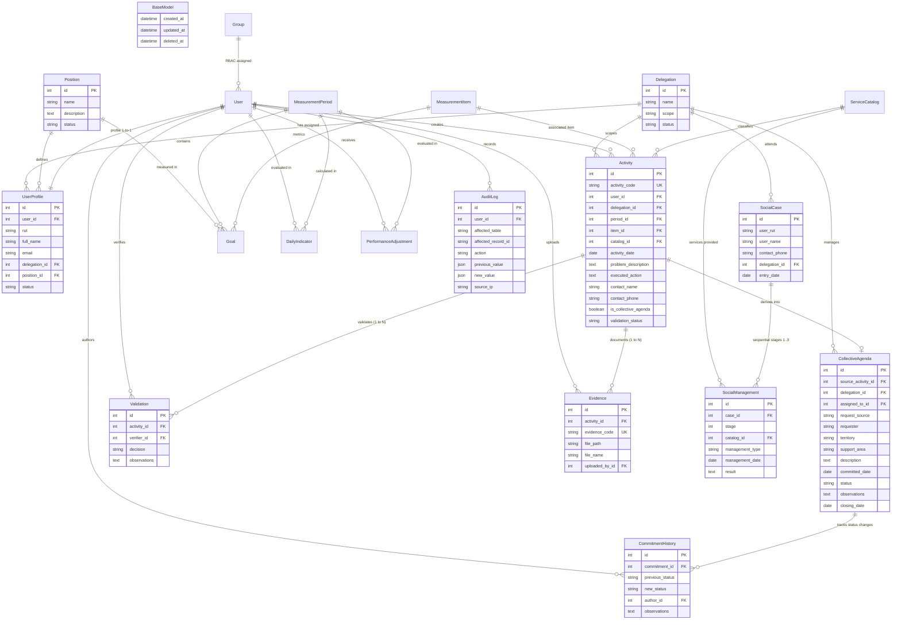

# Sistema de Gestión de Resultados (SGR) — Ilustre Municipalidad de La Serena

Plataforma web institucional desarrollada con **Django** para la gestión, seguimiento territorial, auditoría y evaluación del cumplimiento operativo de las delegaciones municipales de La Serena (Región de Coquimbo, Chile).

> **Evaluación Sumativa II — Taller: Aplicación web con Django Admin**  
> **Carrera:** Ingeniería en Informática / Analista Programador · **INACAP**  
> **Docente:** Javier Ahumada  
> **Grupo:** Grupo F · **Versión:** 2.0.0 (Rama `feature/grupos-permisos-rbac`)

---

## 🏛️ Descripción del Proyecto

El **Sistema de Gestión de Resultados (SGR)** centraliza y audita las actividades comunitarias, casos sociales y compromisos vecinales atendidos por los funcionarios de las delegaciones municipales (**Las Compañías**, **Centro Histórico**, **La Pampa** y **Sector Rural**).

El sistema implementa:
1. **Seguridad y Control de Acceso Basado en Roles (RBAC):** Uso de grupos nativos de Django (`Administradores`, `Verificadores`, `Gestores Territoriales`) y scoping estricto por delegación asignada.
2. **Admin Básico y Admin Pro:** Personalización avanzada de Django Admin con inlines tabulares/apilados, acciones masivas de dominio para reasignación de delegaciones/grupos y validaciones controladas con `clean()`.
3. **Auditoría Forense y Trazabilidad:** Entidad base abstracta `BaseModel` con campos temporales (`created_at`, `updated_at`), soporte de borrado lógico (`deleted_at`) y log inmutable de operaciones críticas (`AuditLog`).
4. **Portabilidad y Despliegue Dual:** Configuración modular mediante variables de entorno (`.env` / `.env.example`) compatible de forma transparente con **SQLite3** (portable sin dependencias) y **MySQL / WampServer**.

---

## 📐 Diagrama Entidad-Relación (ER)

El siguiente modelo entidad-relación refleja con precisión los modelos del dominio implementados en el código fuente, utilizando nomenclatura técnica consistente en **inglés** para entidades y atributos, y relaciones normalizadas:



---

## 🗂️ Arquitectura Modular Django

El proyecto cumple con la separación estricta de responsabilidades en aplicaciones desacopladas por dominio de negocio:

| Aplicación | Responsabilidad Principal | Modelos Registrados | Archivos Clave |
|---|---|---|---|
| **`core`** | Infraestructura transversal, modelo base abstracto y auditoría forense | `BaseModel`, `AuditLog` | [models.py](file:///c:/Users/claseslab9/Desktop/proyectointegrado/core/models.py), [admin.py](file:///c:/Users/claseslab9/Desktop/proyectointegrado/core/admin.py), [views.py](file:///c:/Users/claseslab9/Desktop/proyectointegrado/core/views.py) |
| **`organization`** | Estructura territorial municipal, cargos, perfiles y extensión de usuarios con RUT | `Delegation`, `Position`, `UserProfile`, `User` | [models.py](file:///c:/Users/claseslab9/Desktop/proyectointegrado/organization/models.py), [admin.py](file:///c:/Users/claseslab9/Desktop/proyectointegrado/organization/admin.py), [forms.py](file:///c:/Users/claseslab9/Desktop/proyectointegrado/organization/forms.py) |
| **`activities`** | Catálogo de servicios, registro diario de actividades en terreno, evidencias y validaciones | `ServiceCatalog`, `Activity`, `Evidence`, `Validation` | [models.py](file:///c:/Users/claseslab9/Desktop/proyectointegrado/activities/models.py), [admin.py](file:///c:/Users/claseslab9/Desktop/proyectointegrado/activities/admin.py), [forms.py](file:///c:/Users/claseslab9/Desktop/proyectointegrado/activities/forms.py) |
| **`social`** | Ficha social única ciudadana y gestiones socioeconómicas encadenadas (RN-012) | `SocialCase`, `SocialManagement` | [models.py](file:///c:/Users/claseslab9/Desktop/proyectointegrado/social/models.py), [admin.py](file:///c:/Users/claseslab9/Desktop/proyectointegrado/social/admin.py), [forms.py](file:///c:/Users/claseslab9/Desktop/proyectointegrado/social/forms.py) |
| **`agenda`** | Tubo de trabajo territorial, compromisos ciudadanos futuros y trazabilidad histórica | `CollectiveAgenda`, `CommitmentHistory` | [models.py](file:///c:/Users/claseslab9/Desktop/proyectointegrado/agenda/models.py), [admin.py](file:///c:/Users/claseslab9/Desktop/proyectointegrado/agenda/admin.py), [forms.py](file:///c:/Users/claseslab9/Desktop/proyectointegrado/agenda/forms.py) |
| **`metrics`** | Períodos de medición, ítems medibles, metas ponderadas e indicadores de semáforo | `MeasurementPeriod`, `MeasurementItem`, `Goal`, `DailyIndicator`, `PerformanceAdjustment` | [models.py](file:///c:/Users/claseslab9/Desktop/proyectointegrado/metrics/models.py), [admin.py](file:///c:/Users/claseslab9/Desktop/proyectointegrado/metrics/admin.py) |

---

## ⚡ Cumplimiento Detallado de la Rúbrica (100 / 100 Puntos)

### 1. Conexión a Base de Datos y Migraciones (10 pts)
* **Variables de Entorno:** Configurado vía `python-dotenv` cargando valores desde `.env`.
* **Plantilla Versionada:** Archivo [.env.example](file:///c:/Users/claseslab9/Desktop/proyectointegrado/.env.example) disponible con documentación detallada de cada variable.
* **Portabilidad Dual:**
  * Por defecto: `DB_ENGINE=sqlite3` (listo para levantar en cualquier equipo de laboratorio sin instalar servicios externos).
  * Modo WampServer: `DB_ENGINE=mysql` con host `127.0.0.1`, puerto `3306`, charset `utf8mb4`.
* **Migraciones Limpias:** Migraciones versionadas en cada app (`0001_initial.py`, `0002_...`). `python manage.py check` y `python manage.py migrate` se ejecutan con 0 errores.
* **Sin secretos expuestos:** `SECRET_KEY`, credenciales de base de datos y llaves están excluidos de Git mediante [.gitignore](file:///c:/Users/claseslab9/Desktop/proyectointegrado/.gitignore).

### 2. Arquitectura, Modelado y Auditoría (15 pts)
* **Nomenclatura técnica:** Nombres de tablas, modelos y atributos en inglés (`activity_code`, `delegation`, `problem_description`, `committed_date`, `created_at`, etc.).
* **Etiquetas en español:** Interfaces y formularios con etiquetas amigables en español mediante `verbose_name` y `verbose_name_plural`.
* **Auditoría Transversal con `BaseModel`:** Todas las entidades del dominio heredan de `BaseModel` en [core/models.py](file:///c:/Users/claseslab9/Desktop/proyectointegrado/core/models.py):
  * `created_at` (`DateTimeField`, `auto_now_add=True`)
  * `updated_at` (`DateTimeField`, `auto_now=True`)
  * `deleted_at` (`DateTimeField`, `null=True`, `blank=True` para borrado lógico)
* **Auditoría Forense Inmutable:** Modelo `AuditLog` para registrar transacciones críticas, estrictamente de solo lectura en Django Admin (`has_add_permission=False`, `has_change_permission=False`, `has_delete_permission=False`).

### 3. Admin Básico (10 pts)
Supera el mínimo requerido (4 tablas maestras y 2 operativas) registrando **12 modelos** con todas las configuraciones estándar aplicadas:

| Modelo | Tipo | `list_display` | `search_fields` | `list_filter` | `ordering` | `list_select_related` |
|---|---|:---:|:---:|:---:|:---:|:---:|
| `Delegation` | Maestra | ✓ | ✓ | ✓ | ✓ | N/A |
| `Position` | Maestra | ✓ | ✓ | ✓ | ✓ | N/A |
| `ServiceCatalog` | Maestra | ✓ | ✓ | ✓ | ✓ | N/A |
| `MeasurementPeriod` | Maestra | ✓ | ✓ | ✓ | ✓ | N/A |
| `MeasurementItem` | Maestra | ✓ | ✓ | ✓ | ✓ | N/A |
| `Goal` | Maestra | ✓ | ✓ | ✓ | ✓ | `('period', 'position', 'item')` |
| `UserProfile` | Maestra/Op | ✓ | ✓ | ✓ | ✓ | `('user', 'delegation', 'position')` |
| `Activity` | Operativa | ✓ | ✓ | ✓ | ✓ | `('user', 'delegation', 'period', 'item', 'catalog')` |
| `Evidence` | Operativa | ✓ | ✓ | ✓ | ✓ | `('activity', 'uploaded_by')` |
| `Validation` | Operativa | ✓ | ✓ | ✓ | ✓ | `('activity', 'verifier')` |
| `SocialCase` | Operativa | ✓ | ✓ | ✓ | ✓ | `('delegation',)` |
| `SocialManagement` | Operativa | ✓ | ✓ | ✓ | ✓ | `('case', 'catalog')` |
| `CollectiveAgenda` | Operativa | ✓ | ✓ | ✓ | ✓ | `('delegation', 'assigned_to', 'source_activity')` |
| `CommitmentHistory` | Operativa | ✓ | ✓ | ✓ | ✓ | `('commitment', 'author')` |
| `DailyIndicator` | Operativa | ✓ | ✓ | ✓ | ✓ | `('user', 'period')` |
| `AuditLog` | Auditoría | ✓ | ✓ | ✓ | ✓ | `('user',)` |

### 4. Admin Pro (15 pts)
* **Inlines Integrados (7 inlines activos):**
  1. `UserProfileStackedInline` en `UserAdmin`: Asigna RUT, delegación, cargo y estado directamente desde la edición del usuario.
  2. `UserProfileDelegationInline` en `DelegationAdmin`: Lista funcionarios asignados a la delegación.
  3. `EvidenceInline` en `ActivityAdmin`: Carga y visualización de archivos y evidencias fotográficas.
  4. `ValidationInline` en `ActivityAdmin`: Registro de dictamen del verificador.
  5. `SocialManagementInline` en `SocialCaseAdmin`: Secuencia de gestiones socioeconómicas (etapas 1 a 3).
  6. `CommitmentHistoryInline` en `CollectiveAgendaAdmin`: Registro cronológico de cambios de estado del compromiso.
  7. `GoalInline` en `MeasurementPeriodAdmin`: Carga de metas por cargo e ítem en el período.
* **Acciones Masivas de Dominio Personalizadas:**
  * En `UserAdmin`:
    * `👑 Asignar Grupo: Administradores`
    * `🔍 Asignar Grupo: Verificadores`
    * `📋 Asignar Grupo: Gestores Territoriales`
    * `🏛️ Asignar Delegación: Centro Histórico`
    * `🏛️ Asignar Delegación: Las Compañías`
    * `🏛️ Asignar Delegación: La Pampa`
    * `🏛️ Asignar Delegación: Sector Rural`
    * `✅ Activar cuentas seleccionadas`
    * `⛔ Desactivar cuentas seleccionadas`
  * En `ActivityAdmin`:
    * `✓ Aprobar actividades seleccionadas`
    * `⚠ Marcar para corrección`
    * `🗑️ Aplicar borrado lógico (Soft delete)`
    * `♻️ Restaurar registros eliminados`
  * En `SocialCaseAdmin`:
    * `📋 Derivar casos a evaluación técnica social`
    * `🗑️ Aplicar borrado lógico` / `♻️ Restaurar casos`
  * En `CollectiveAgendaAdmin`:
    * `⏳ Marcar compromisos como En Proceso`
    * `✓ Marcar compromisos como Cumplidos`
    * `🗑️ Aplicar borrado lógico` / `♻️ Restaurar compromisos`
* **Validaciones Controladas mediante `clean()` y `ModelForm`:**
  * `Activity.clean()`: Rechazo automático de fechas de actividad posteriores a la fecha actual. Exigencia de nombre de contacto si la actividad deriva a agenda colectiva.
  * `SocialCase.clean()`: Rechazo de fechas de ingreso futuras.
  * `SocialManagement.clean()`: Restricción estricta a un máximo de 3 etapas de gestión consecutivas (RN-012).
  * `CollectiveAgenda.clean()`: Validación de fecha de cierre posterior o igual a la fecha comprometida.
  * `MeasurementPeriod.clean()`: Rechazo de fecha de término anterior a fecha de inicio.
  * `Goal.clean()`: Validación de ponderación porcentual válida (1% a 100%).
  * `UserProfileForm.clean_rut()`: Validación de formato y caracteres válidos de RUT chileno.

### 5. Seguridad: Roles, Scoping y Restricciones (15 pts)
* **RBAC con Grupos nativos de Django:** Se eliminó cualquier modelo `Role` redundante. Los permisos se delegan a `django.contrib.auth.models.Group`:
  * `Administradores`: Permisos transversales totales (`is_superuser=True` o `all_permissions`).
  * `Verificadores`: Solo lectura y validación de evidencias y actividades.
  * `Gestores Territoriales`: Creación y edición operativa en terreno, **sin permisos de eliminación física**.
* **Scoping Territorial por Delegación (`get_queryset`):**
  * `admin` visualiza los registros de todas las delegaciones comunales.
  * `funcionario_companias` **solo visualiza y edita** actividades, casos sociales y compromisos pertenecientes a la **Delegación Las Compañías**.
  * Si un funcionario intenta acceder por URL directa a un registro de otra delegación, el método `has_change_permission(obj)` rechaza la petición.
* **Bloqueo de Eliminación Física:**
  * En `ActivityAdmin`, `SocialCaseAdmin`, `CollectiveAgendaAdmin`, `DelegationAdmin`, `PositionAdmin`, `UserAdmin`:
    * `has_delete_permission` retorna `False` para cualquier usuario que no pertenezca al grupo `Administradores`.
    * La depuración se realiza mediante las acciones de **borrado lógico (soft delete)** sobre `deleted_at`.

### 6. Documentación y Reproducibilidad (10 pts)
* **Carga Reproducible de Datos:**
  * Comando oficial `python manage.py seed_data` puebla automáticamente:
    * 4 Delegaciones maestras.
    * 4 Cargos institucionales.
    * 3 Grupos de Django con permisos granulares.
    * 9 Usuarios de prueba en distintos contextos y delegaciones.
    * Catálogo de servicios, períodos, ítems de medición y metas.
    * Actividades reales con evidencias y validaciones.
    * Casos sociales con gestiones encadenadas.
    * Agenda colectiva con historial de estados.
    * Registros iniciales de auditoría transversal.
* **Portabilidad Comprobada:** Todo el entorno se levanta desde cero en menos de 2 minutos siguiendo las instrucciones de este README.

### 7. Revisión y Defensa en Vivo (15 pts)
* Ver sección [Guía de Defensa en Vivo para la Evaluación](#-guía-de-defensa-en-vivo-para-la-evaluación).

### 8. Gestión Git y Trabajo en Ramas (10 pts)
* **Ramas Descriptivas:** Desarrollo de funcionalidades y RBAC realizado en la rama `feature/grupos-permisos-rbac`.
* **Commits Convencionales:** Mensajes claros (`feat: ...`, `fix: ...`, `docs: ...`).
* **Higiene del Repositorio:** El archivo `.gitignore` previene estrictamente la subida de `.env`, `.venv/`, `db.sqlite3` o archivos compilados `__pycache__`.

---

## 👥 Cuentas de Prueba y Credenciales

Todas las contraseñas han sido estandarizadas para facilitar la demostración ante el docente:

| Usuario | Contraseña | RUT | Grupo / Rol | Delegación Asignada | Alcance / Permisos |
|---|---|---|---|---|---|
| **`admin`** | `Admin1234!` | `11.111.111-1` | `Administradores` (Superuser) | Centro Histórico | **Acceso Total Comunal:** Todas las delegaciones, reasignación de grupos, delegaciones y eliminación |
| **`admin_control`** | `Admin1234!` | `13.444.555-6` | `Administradores` | Centro Histórico | **Control y Gestión:** Acceso transversal y auditoría global |
| **`verificador`** | `Verificador1234!` | `15.678.901-2` | `Verificadores` | Las Compañías | **Revisión y Aprobación:** Validación formal de actividades y evidencias |
| **`verificador_centro`** | `Verificador1234!` | `16.789.012-3` | `Verificadores` | Centro Histórico | Revisión técnica de evidencias sector Centro |
| **`verificador_rural`** | `Verificador1234!` | `14.567.890-1` | `Verificadores` | Sector Rural | Revisión técnica de evidencias sector Rural |
| **`funcionario_companias`** | `Funcionario1234!` | `17.892.456-3` | `Gestores Territoriales` | **Las Compañías** | **Contexto Limitado 1:** Solo visualiza/edita datos de Las Compañías. Sin permisos de eliminación |
| **`funcionario_centro`** | `Funcionario1234!` | `18.345.678-K` | `Gestores Territoriales` | **Centro Histórico** | **Contexto Limitado 2:** Solo visualiza/edita datos de Centro Histórico |
| **`funcionario_pampa`** | `Funcionario1234!` | `12.345.678-K` | `Gestores Territoriales` | **La Pampa** | Gestión territorial sector Sur |
| **`funcionario_rural`** | `Funcionario1234!` | `19.876.543-2` | `Gestores Territoriales` | **Sector Rural** | Gestión territorial localidades rurales |

---

## 🚀 Instalación y Puesta en Marcha

### 1. Clonar el repositorio y situarse en la rama de trabajo
```bash
git clone https://github.com/KevinInacap/proyectointegrado.git
cd proyectointegrado
git checkout feature/grupos-permisos-rbac
```

### 2. Crear y activar el entorno virtual
* **En Windows (PowerShell):**
  ```powershell
  python -m venv .venv
  .\.venv\Scripts\Activate.ps1
  ```
* **En Windows (Git Bash):**
  ```bash
  python -m venv .venv
  source .venv/Scripts/activate
  ```

### 3. Instalar dependencias
```bash
pip install -r requirements.txt
```

### 4. Configurar variables de entorno (`.env`)
Copiar la plantilla de ejemplo:
```bash
cp .env.example .env
```
* **Opción A: SQLite (Recomendada para evaluación inmediata en laboratorio):**
  El archivo `.env` ya viene configurado con `DB_ENGINE=sqlite3`. No requiere encender WampServer ni configurar usuarios.
* **Opción B: WampServer / MySQL:**
  Si el docente solicita demostración en WampServer:
  1. Iniciar WampServer y verificar que MySQL esté en verde (puerto 3306).
  2. Crear la base de datos `sgr_municipal` en phpMyAdmin (`http://localhost/phpmyadmin`).
  3. Modificar en `.env`:
     ```env
     DB_ENGINE=mysql
     DB_NAME=sgr_municipal
     DB_USER=root
     DB_PASSWORD=
     DB_HOST=127.0.0.1
     DB_PORT=3306
     ```

### 5. Verificar integridad y aplicar migraciones
```bash
python manage.py check
python manage.py migrate
```

### 6. Cargar datos reproducibles iniciales (Seed)
```bash
python manage.py seed_data
```

### 7. Ejecutar suite de pruebas unitarias
```bash
python manage.py test
```
*(Debe reportar `Ran 8 tests ... OK` confirmando validaciones de modelos, auditoría y seguridad).*

### 8. Iniciar el servidor web de desarrollo
```bash
python manage.py runserver
```

Acceso en el navegador:
* **Portal Institucional SGR:** `http://127.0.0.1:8000/` *(Permite login con RUT o Username)*
* **Panel de Administración Django:** `http://127.0.0.1:8000/admin/`

---

## 🎨 Diseño Visual del Portal de Acceso (Login)

La pantalla de acceso combina identidad comunal y tecnología moderna:
* **Fotografía Panorámica del Faro Monumental:** Capturada al atardecer en alta resolución por *Kevin Encina Molina y Scarlett Williams Medalla*. Encuadre asimétrico con regla de los tercios para armonizar con el formulario.
* **Glassmorphism:** Tarjeta de autenticación con `backdrop-filter: blur(28px) saturate(200%)`, biselado con luz cenital y micro-interacción 3D con Vanilla Tilt.
* **Acceso Dual:** Permite autenticarse indistintamente ingresando el RUT chileno con formato (`11.111.111-1`) o el nombre de usuario (`admin`).

---

## 🧑‍🏫 Guía de Defensa en Vivo para la Evaluación

Cuando el profesor solicite verificar cada punto de la rúbrica, utiliza esta guía para responder y demostrar de inmediato:

### 1. "¿Dónde están las variables de entorno y cómo cambio de SQLite a MySQL?"
* Muestra el archivo [.env](file:///c:/Users/claseslab9/Desktop/proyectointegrado/.env) y [.env.example](file:///c:/Users/claseslab9/Desktop/proyectointegrado/.env.example).
* Muestra [config/settings.py](file:///c:/Users/claseslab9/Desktop/proyectointegrado/config/settings.py#L90-L115), donde la variable `DB_ENGINE` conmuta automáticamente entre `django.db.backends.sqlite3` y `django.db.backends.mysql`.

### 2. "¿Dónde está el BaseModel con los campos de auditoría requeridos?"
* Abre [core/models.py](file:///c:/Users/claseslab9/Desktop/proyectointegrado/core/models.py#L4-L14).
* Explica que `created_at`, `updated_at` y `deleted_at` (soft delete) son heredados por todos los modelos de `organization`, `activities`, `social`, `agenda` y `metrics`.

### 3. "¿Cómo demuestras el Scoping de Seguridad por Delegación?"
1. Abre una ventana de incógnito en el navegador e ingresa a `http://127.0.0.1:8000/admin/` con el usuario `funcionario_companias` (Contraseña: `Funcionario1234!`).
2. Entra a **Actividades**, **Casos Sociales** y **Agenda Colectiva**: observa que **solo aparecen registros de Las Compañías**.
3. En otra pestaña normal, inicia sesión como `admin` (Contraseña: `Admin1234!`): observa que aparecen los registros de **todas las delegaciones** (Las Compañías, Centro Histórico, La Pampa, Rural).
4. Muestra el código en [activities/admin.py](file:///c:/Users/claseslab9/Desktop/proyectointegrado/activities/admin.py#L133-L140), [social/admin.py](file:///c:/Users/claseslab9/Desktop/proyectointegrado/social/admin.py#L60-L68) y [agenda/admin.py](file:///c:/Users/claseslab9/Desktop/proyectointegrado/agenda/admin.py#L81-L88) donde el método `get_queryset()` aplica el filtro según el perfil de delegación del usuario autenticado.

### 4. "¿Cómo demuestras que el usuario limitado no puede borrar registros?"
* Con la sesión de `funcionario_companias`, selecciona un registro y abre el menú de acciones: comprueba que **no existe la opción de eliminar registros**, ni botón rojo de eliminar en el formulario.
* Muestra el método `has_delete_permission()` en los archivos `admin.py`, el cual restringe el borrado exclusivamente a usuarios del grupo `Administradores`.

### 5. "¿Dónde están los Inlines y las Acciones Masivas (Admin Pro)?"
* **Inlines:** Entra a **Usuarios** como `admin` y edita cualquier usuario: muestra el inline apilado de **Perfil Institucional y Delegación** donde se cambia RUT, Cargo y Delegación en una sola pantalla. Entra a **Actividades** y muestra los inlines de **Evidencias** y **Validaciones**.
* **Acciones Masivas:** En el listado de **Usuarios**, selecciona uno o varios usuarios y despliega el menú `Acción`: muestra las acciones para cambiar masivamente el grupo a `Administradores`, `Verificadores` o `Gestores Territoriales`, o asignar delegaciones (`Las Compañías`, `Centro Histórico`, etc.).

### 6. "¿Dónde están las validaciones controladas clean()?"
* Intenta crear una **Actividad** con una fecha de mañana: Django Admin disparará el error `"La fecha de la actividad no puede ser posterior a la fecha actual."` definido en `Activity.clean()` ([activities/models.py](file:///c:/Users/claseslab9/Desktop/proyectointegrado/activities/models.py#L123-L133)).
* Intenta crear una etapa de gestión con valor `4`: disparará el error de normativa comunal RN-012 definido en `SocialManagement.clean()` ([social/models.py](file:///c:/Users/claseslab9/Desktop/proyectointegrado/social/models.py#L70-L76)).

---

## 🌿 Gestión Git y Trabajo en Ramas

El flujo de trabajo respeta las directrices del Criterio 8 de la rúbrica:

* **Rama activa de desarrollo:** `feature/grupos-permisos-rbac`
* **Subir cambios de la rama al repositorio remoto:**
  ```bash
  git push origin feature/grupos-permisos-rbac
  ```
* **Integrar a `main` mediante merge (si el docente solicita entrega directa en rama principal):**
  ```bash
  git checkout main
  git merge feature/grupos-permisos-rbac
  git push origin main
  git checkout feature/grupos-permisos-rbac
  ```

---

**Ilustre Municipalidad de La Serena · Dirección de Gestión y Control Territorial**  
*Desarrollado para la Evaluación Sumativa II · Taller de Aplicaciones Web con Django Admin*
